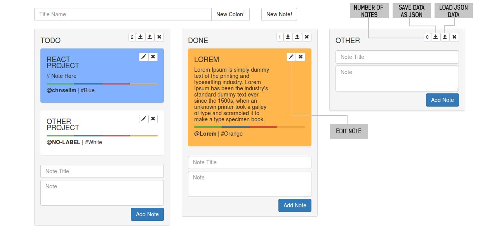

<h1 align="center"></img><BR>
</img></h1>

* [What is a Kanban Board ?](https://leankit.com/learn/kanban/kanban-board/)



## Installation
```
npm install --no-optional

npm start
```
## Todo

- [x] Dynamically add colons & notes
- [x] Show number of notes
- [x] Edit & Delete notes
- [x] Assign labels to the notes,
- [x] Colored labels
- [x] Local Storage
- [x] Import & Export JSON
- [ ] Drag & Drop
